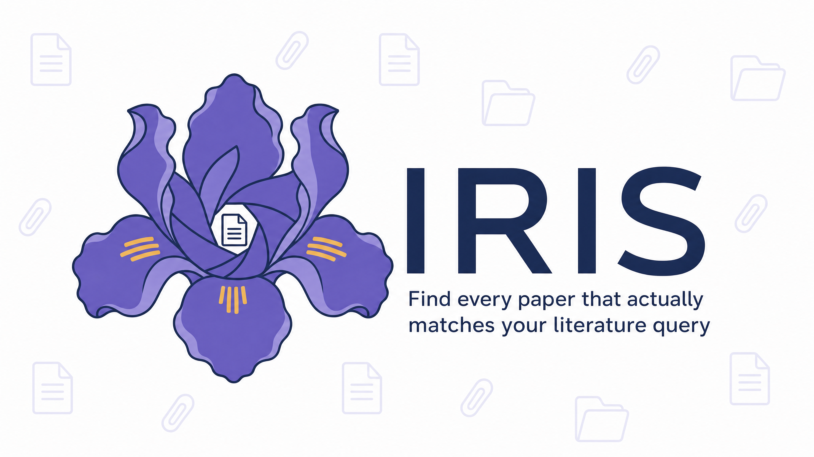
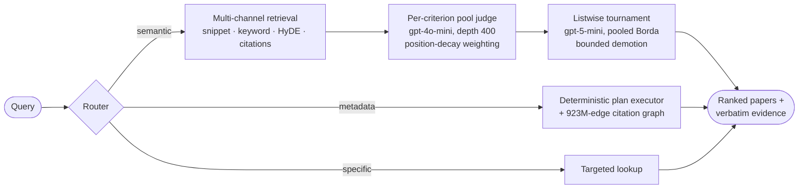
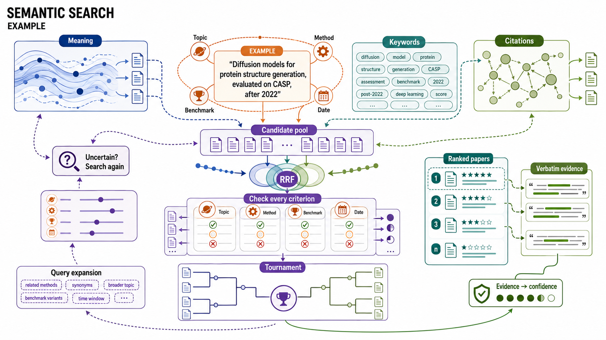
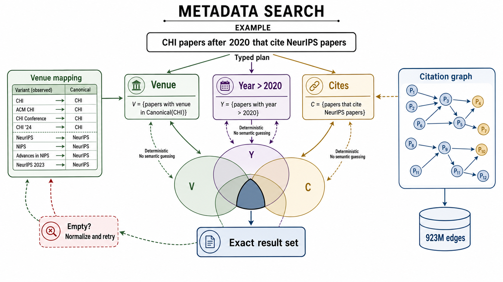
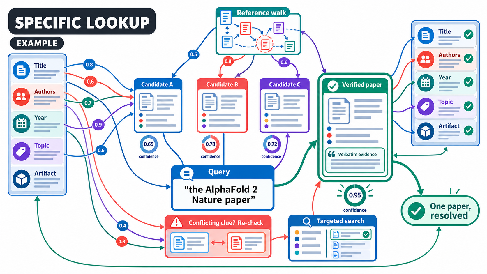

<div align="center">



<br/><br/>

[-4c72b0?style=flat-square)](#results)
[](#results)
[](#quickstart)
[](LICENSE)

[How it works](#how-it-works) · [Quickstart](#quickstart) · [Results](#results) · [Configuration](#configuration) · [Notes from development](#notes-from-development)

</div>

---

IRIS takes a natural language literature query like

> "Find papers that use diffusion models for protein structure generation, evaluate on CASP targets, and were published after 2022."

and returns a ranked list of papers where every stated constraint has been checked against the paper's actual text, with verbatim evidence attached to each result.

It is scored under the official AstaBench harness (`astabench 0.5.4`, live GPT-4o grading). The run submitted to Ai2's AstaBench leaderboard as "Rasyn IRIS" on 2026-08-19 scored 0.386 and is in Ai2's review queue; the code in this repository, re-run afterwards on all 66 validation queries, scores 0.382.

## Results

AstaBench PaperFindingBench, validation split, official harness:

| System | Adjusted F1 | Cost / query | Source |
|---|---|---|---|
| **IRIS (this repo)** | **0.382** | ~$0.13 | this exact code, official harness, all 66 queries |
| Asta Paper Finder (Ai2) | 0.380 | ~$0.07 | Ai2's leaderboard results dataset |

On the test split, which IRIS has not run yet, Ai2's Asta Paper Finder scores 0.433 at ~$0.35/query and RoboPhD currently leads at 0.440. Validation and test are different query sets; do not compare numbers across them.

### The fine print

We would rather you read this here than discover it in the comments.

- **We headline the number this code produces, not our best run.** Seven official-harness runs, all of them: 0.384 (early configuration, before the citation-graph fix), 0.366 and 0.357 (fully live retrieval), 0.376 (cache-served, earlier configuration), 0.386 (the run submitted to Ai2), 0.384 (a 3-pass tournament variant), and 0.382 (this repository's code, re-run after the pre-release bug fixes below). The whole spread sits in the semantic slice, which measures 0.228 to 0.249 across repeats because the LLM judge is nondeterministic; the metadata slice (0.682) and specific slice (0.880) are stable. Cost is $0.131/query mean from the re-run's own per-sample metering, and includes the gpt-4o topic-verification calls on the specific-paper channel (`PFBMAX_TOPIC_MODEL`).
- **Read 0.382 vs 0.380 as a tie, not a win.** The difference is far smaller than our own run-to-run noise, and Ai2's agent costs roughly half as much per query. With fully live retrieval we score below them (0.357 and 0.366 vs 0.380); that gap is retrieval infrastructure, not modeling. The claim we stand behind: an open-source system that matches Ai2's production paper finder on this split when corpus access is not the bottleneck.
- **Validation is the public development split.** Like the published baselines, we report validation, and it is also the split we developed against. Treat this as a dev-split result until our test-split run lands.
- **The repository code differs slightly from the submitted run.** Pre-release review found four real bugs (a citation-graph shortcut that dropped query conditions, a rate limiter running at double the configured rate, a truncation that discarded query expansions at raised settings, and silent zero-score runs on missing credentials). They are fixed here and the 0.382 figure is measured with them in place.
- **Certified runs served corpus retrieval from a local response cache** (built from the same corpus API) because Semantic Scholar's public endpoint aggressively rate-limits; our fully live-retrieval runs scored 0.357 and 0.366. The harness entry point always wraps the corpus client in a read-through cache that fills `pfbmax/cache/` as it runs; `PFBMAX_CACHE_ONLY=1` makes a run serve exclusively from it. If you hit 429s, set `PFBMAX_USE_MCP=1` to route through Asta's MCP gateway (MCP keys are issued at allenai.org/asta/resources, separate from the Semantic Scholar key).
- **The 923M-edge citation graph is not shipped.** It is a ~360GB build from Semantic Scholar's bulk datasets; this repo does not include the build tooling yet. Without it, citation-constrained metadata queries fall back to live APIs.
- **The public history is a single clean commit.** The development repository contains benchmark reference data that we are not licensed to redistribute, so the public tree is a clean export rather than the full history.
- **`iris_asta/` is our general AstaBench client and solver library** from the same project; IRIS exercises only its paper-finder path.

## How it works



One cheap LLM call routes each query to the channel built for it: `semantic` (fuzzy topical), `metadata` (venue, year, author, or citation constraints), or `specific` (a known paper). Deterministic channels that come back empty fall through to semantic, since an empty answer scores zero and the judged channel can only help.

### Semantic search



The semantic channel fans out across snippet search, keyword paper search, hypothetical-abstract (HyDE) probes, and citation expansion, then fuses everything with reciprocal rank fusion. The query is decomposed into explicit relevance criteria, and a gpt-4o-mini pool judge scores the top 400 candidates against each criterion separately, with position-decay weighting (later auto-derived criteria are noisier, so they count less). Pointwise scores strand real matches in the ambiguous middle, so a gpt-5-mini listwise tournament reorders that contested band with sliding windows, pooled Borda aggregation across passes, and a bounded demotion cap so one bad window cannot destroy a good paper's rank.

### Metadata search



"Papers at CHI after 2020 citing NeurIPS papers" is a database query, not a similarity search. The metadata channel compiles the query into a typed plan (venue set, year filter, citation set) and executes the intersection deterministically, with venue canonicalization and acronym expansion on both sides. When the local citation graph is present, venue-to-venue citation constraints run against it instead of rate-limited APIs; other citation constraints use the corpus API.

### Specific lookup



When the query names one paper ("the AlphaFold 2 Nature paper"), IRIS extracts every clue it can (title fragments, authors, year, topic, artifacts), scores candidates against all of them, and walks references when direct resolution fails. It returns its best match: one paper in the typical case, a small hedged set when the name is genuinely ambiguous, with verbatim evidence either way.

## Quickstart

```bash
git clone https://github.com/rasynai/rasyn-iris.git
cd rasyn-iris
pip install astabench==0.5.4
```

Create `iris_asta/.env` (see [`.env.example`](iris_asta/.env.example)):

```bash
OPENAI_API_KEY=sk-...
ASTA_TOOL_KEY=...        # free at https://api.semanticscholar.org
```

Run the benchmark under the official harness with the leaderboard configuration:

```bash
PFBMAX_CJ_POOL=1 PFBMAX_CJ_POOL_DEPTH=400 PFBMAX_CJ_MODEL=gpt-4o-mini \
PFBMAX_CJ_POSDECAY=0.6 PFBMAX_TOURN=1 PFBMAX_TOURN_MODEL=gpt-5-mini \
inspect eval astabench/paper_finder_validation \
  --solver pfbmax/inspect_entry.py@pfbmax_solver \
  --model openai/gpt-4o-mini
```

Our own live-retrieval runs of this command scored 0.357 and 0.366. Read
"Performance and rate limits" below before you start: on the public corpus API
this is not a quick command.

### Performance and rate limits

Everything here is measured, on our hardware, in August 2026:

| What | Observed |
|---|---|
| One metadata query (venue, year, citation constraints) | about 6 seconds |
| One specific-paper lookup | about 1 minute |
| One semantic query, cold cache, public API | did not finish within 15 minutes |
| A single corpus call | 1 to 30 seconds, highly variable |

The semantic channel deliberately issues dozens of corpus calls per query
(rephrasings, HyDE probes, citation expansion) because pool recall is the
ceiling on the score. On the free public endpoint that is slow, and it can
stall entirely when you are being rate limited. Nothing is hung; it is
waiting on the API. Practical advice:

- The read-through cache in `pfbmax/cache/` makes repeat runs much faster, and
  the certified runs above were served from a warmed cache.
- If you have Asta MCP access, `PFBMAX_USE_MCP=1` routes corpus calls through
  the gateway instead of the public endpoint.
- For a quick smoke test rather than a scored run, shrink the fanout:
  `PFBMAX_MAX_REPHRASINGS=2 PFBMAX_MAX_CRITERIA=3 PFBMAX_MAX_HYDE=1
  PFBMAX_MAX_CALLS=12`. Expect a much weaker result; this is for checking that
  your keys and wiring work.
- Missing or invalid keys now fail immediately with a message rather than
  producing a silent zero-score run.

Or call IRIS from your own code:

```python
import os, sys
sys.path += ["pfbmax", "iris_asta"]
for line in open("iris_asta/.env"):
    if "=" in line and not line.startswith("#"):
        k, v = line.strip().split("=", 1)
        os.environ.setdefault(k, v)

from iris_asta.asta_client import AstaClient
from iris_asta.config import load_config
from llm import LLM
import router

client = AstaClient(load_config())
results = router.solve(
    "diffusion models for protein structure generation evaluated on CASP, after 2022",
    client, LLM(), inserted_before=None,
)
for paper_id, evidence in results:
    print(paper_id, evidence[:100])
```

`router.solve` never raises. It routes, retrieves, judges, and returns `[(corpus_id, verbatim_evidence), ...]` best first. A semantic query fans out into many corpus calls, so with a fresh key expect a first run to take several minutes; if the public API is rate-limiting you hard, set `PFBMAX_USE_MCP=1`.

## Configuration

Everything is tunable by environment variable. The configuration of the certified runs:

| Variable | Value | What it does |
|---|---|---|
| `PFBMAX_CJ_POOL` | `1` | enable the per-criterion pool judge |
| `PFBMAX_CJ_MODEL` | `gpt-4o-mini` | pool judge model (unset, the code default is gpt-4o-mini) |
| `PFBMAX_CJ_POOL_DEPTH` | `400` | candidates judged per query |
| `PFBMAX_CJ_POSDECAY` | `0.6` | criterion position-decay weight |
| `PFBMAX_TOURN` | `1` | enable the listwise tournament (unset any of these to disable) |
| `PFBMAX_TOURN_MODEL` | `gpt-5-mini` | tournament ranking model |
| `PFBMAX_TOURN_PASSES` | `2` | tournament passes over the contested band |
| `PFBMAX_TOURN_PRIOR` | `0.4` | blend weight of the pointwise prior |
| `PFBMAX_TOURN_DEMOTE_CAP` | `8` | max ranks a paper can fall per tournament |
| `PFBMAX_TOPIC_MODEL` | `gpt-4o-2024-11-20` | topic-verification model on the specific-paper channel (default) |
| `PFBMAX_USE_MCP` | unset | set to `1` to route corpus calls via Asta's MCP gateway (rate-limit fallback) |
| `PFBMAX_CITEGRAPH` / `PFBMAX_PMETA` | *paths* | optional local citation graph + metadata SQLite (build tooling not included) |

The certified runs also widened the retrieval fanout beyond the shipped
defaults. For completeness, that environment was:

| Variable | Value | What it does |
|---|---|---|
| `PFBMAX_CJ_WORKERS` | `8` | parallel judge requests |
| `PFBMAX_MAX_CALLS` | `220` | corpus-call budget per query |
| `PFBMAX_SEEDS` / `PFBMAX_SEED_POOL` | `10` / `20` | citation-expansion seeds and the window they come from |
| `PFBMAX_LIMIT_SNIPPET_RAW` | `150` | snippet depth for the raw query |
| `PFBMAX_LIMIT_SNIPPET_HYDE` | `150` | snippet depth per HyDE probe |
| `PFBMAX_LIMIT_CITATIONS` | `120` | citation rows per direction per seed |
| `PFBMAX_FANOUT_WORKERS` | `5` | parallel corpus probes |
| `PFBMAX_FETCH_RETRIES` | `2` | retries per corpus call |
| `PFBMAX_CACHE_ONLY` | `1` | serve corpus reads only from the local cache |

## Repository layout

| Path | What lives there |
|---|---|
| [`pfbmax/router.py`](pfbmax/router.py) | query classification and channel dispatch, start here |
| [`pfbmax/criterion_judge.py`](pfbmax/criterion_judge.py) | the per-criterion pool judge |
| [`pfbmax/tournament.py`](pfbmax/tournament.py) | listwise tournament reranker |
| [`pfbmax/metadata_solver.py`](pfbmax/metadata_solver.py) | deterministic metadata plans and citation graph execution |
| [`pfbmax/inspect_entry.py`](pfbmax/inspect_entry.py) | official harness entry point |
| [`iris_asta/`](iris_asta/) | corpus client, config, rate limiting, snapshot date enforcement |

## Notes from development

Every component here earned its place through a controlled experiment; losers were deleted or left flag-gated off. The campaign kept a written ledger (23 entries) and finished with six official harness runs. Things that did not work, so you do not have to retry them:

- Trained cross-encoder rerankers (several variants): never beat the LLM judge
- Bradley-Terry and PageRank aggregation: pooled Borda won
- Hierarchical tournaments: flat sliding windows won
- Permissive judge prompts, evidence enrichment, prior blends at admission: all net negative

Things that paid: position-decay criterion weighting, the tournament package (pooled cross-pass Borda + pointwise prior + demotion cap), and the local citation graph.

The demotion cap is a good example of the approach. Pilot runs showed one rescue worth +0.094 but two catastrophic demotions, so ascent is unlimited and descent is capped at 8 ranks. Pooled Borda plus that asymmetry is what took the tournament from net zero to net positive.

## Contributing

Issues and PRs welcome. One rule: no change lands without a measured comparison under the official harness (`inspect eval astabench/paper_finder_validation ...`). Post the before/after in the PR.

## License

[MIT](LICENSE) © 2026 [Rasyn AI](https://rasyn.ai). AstaBench (benchmark, harness, grading) is Ai2's work, used as a pip dependency. One exception to "no Ai2 content in this repo": the pool judge intentionally reproduces the harness's Apache-2.0 judging prompt so that selection matches grading; see [THIRD_PARTY_NOTICES.md](THIRD_PARTY_NOTICES.md) for the attribution and license text.

---

<div align="center">
<sub>Built by <a href="https://rasyn.ai">Rasyn AI</a> · Benchmarked on <a href="https://huggingface.co/spaces/allenai/asta-bench-leaderboard">AstaBench</a> by Ai2 · Mirrored on <a href="https://huggingface.co/rasynai/rasyn-iris">Hugging Face</a></sub>
</div>
